# Architecture Diagram - Grafana SSO with Microsoft Entra ID

## System Overview

This diagram illustrates the OIDC (OpenID Connect) authentication flow between Grafana and Microsoft Entra ID for Single Sign-On (SSO).

```mermaid
graph LR
    subgraph Local["🏠 Local - Docker"]
        Grafana["📊 Grafana OSS<br/>:3001"]
    end
    
    subgraph Azure["☁️ Azure"]
        EntraID["🔐 Entra ID<br/>(OIDC Provider)"]
    end
    
    subgraph User["👤 User"]
        Browser["🌐 Browser"]
    end
    
    Browser -->|"1. Access Grafana"| Grafana
    Grafana -->|"2. Redirect to Login"| EntraID
    EntraID -->|"3. Authentication"| Browser
    Browser -->|"4. Authorization Code"| Grafana
    Grafana -->|"5. Exchange Code for Token"| EntraID
    EntraID -->|"6. ID Token + roles"| Grafana
    Grafana -->|"7. Grant Access<br/>(Admin/Editor/Viewer)"| Browser
    
    classDef local fill:#e3f2fd,stroke:#1976d2,stroke-width:2px,color:#212121
    classDef azure fill:#e8f5e9,stroke:#388e3c,stroke-width:2px,color:#212121
    classDef user fill:#fff3e0,stroke:#f57c00,stroke-width:2px,color:#212121
    
    class Grafana local
    class EntraID azure
    class Browser user
```



## OIDC Authentication Flow

### Authorization Code Flow (with PKCE-like security)

1. **User Access**: User navigates to Grafana at `http://localhost:3001`
2. **Redirect to Entra ID**: Grafana redirects to Microsoft Entra ID login page
3. **User Authentication**: User enters credentials and authenticates with Entra ID
4. **Authorization Code**: Entra ID redirects back to Grafana with authorization code
5. **Token Exchange**: Grafana exchanges code for **ID Token** (backend call)
6. **ID Token with Roles**: Entra ID returns **ID Token** containing user info and `roles` claim
7. **Role-Based Access**: Grafana reads `roles` claim from ID Token and maps to Grafana roles:
   - `Admin` → GrafanaAdmin (full administrative access)
   - `Editor` → Editor (create/edit dashboards and queries)
   - `Viewer` → Viewer (read-only access)

### How Role Mapping Works

**ID Token Structure (JWT):**
```json
{
  "sub": "user-id-guid",
  "name": "John Doe",
  "email": "john@contoso.com",
  "roles": ["Admin"],  // ← Roles from Entra ID App Roles
  "aud": "client-id",
  "iss": "https://login.microsoftonline.com/{tenant}/v2.0"
}
```

**Grafana Role Mapping (JMESPath expression):**
```
role_attribute_path = contains(roles[*], 'Admin') && 'Admin' || contains(roles[*], 'Editor') && 'Editor' || 'Viewer'
```

**Mapping Logic:**
1. Grafana reads the `roles` array from the **ID Token** (not Access Token)
2. Checks if `Admin` exists in roles → grants GrafanaAdmin
3. If not, checks if `Editor` exists → grants Editor
4. If neither, grants Viewer (default)

**Important Notes:**
- 🔑 **ID Token** is used for authentication and contains user identity + roles
- ❌ **Access Token** is NOT used in this flow (Grafana doesn't call downstream APIs)
- ✅ Roles are assigned in Entra ID via "Enterprise Applications → Users and groups"
- ✅ ID Token must include `roles` claim (configured in "Token configuration")

## Components

| Component | Port | Technology | Purpose |
|-----------|------|------------|---------|
| **Grafana OSS** | 3001 | Grafana 11.x | Observability platform with SSO |
| **Entra ID** | N/A | Microsoft Entra ID | OIDC Identity Provider |
| **Browser** | N/A | User Agent | Authentication UI |

## Security Configuration

### Entra ID App Registration

**Platform:** Web Application
- **Redirect URI:** `http://localhost:3001/login/generic_oauth`
- **Client Secret:** Yes (confidential client)
- **Token Configuration:**
  - ID Token includes `roles` claim
  - `accessTokenAcceptedVersion`: 2

**App Roles:**
| Role | Value | Description |
|------|-------|-------------|
| Grafana Administrator | `Admin` | Full admin access |
| Grafana Editor | `Editor` | Create/edit dashboards |
| Grafana Viewer | `Viewer` | Read-only access |

### Grafana Configuration

```ini
[auth.generic_oauth]
enabled = true
name = Microsoft Entra ID
client_id = YOUR_CLIENT_ID
client_secret = YOUR_CLIENT_SECRET
auth_url = https://login.microsoftonline.com/{tenant}/oauth2/v2.0/authorize
token_url = https://login.microsoftonline.com/{tenant}/oauth2/v2.0/token
api_url = https://graph.microsoft.com/oidc/userinfo
scopes = openid email profile
role_attribute_path = contains(roles[*], 'Admin') && 'Admin' || contains(roles[*], 'Editor') && 'Editor' || 'Viewer'
```

## Key Features

### ✅ Advantages
- **OSS Compatible**: Works with free Grafana (no enterprise license)
- **Simple Setup**: 5-minute configuration
- **Modern Protocol**: OIDC (JSON-based, not XML like SAML)
- **Role-Based Access**: Automatic role mapping from Entra ID
- **Single Sign-On**: Users authenticate once across applications

### 🔒 Security Benefits
- **No Password Storage**: Grafana never handles user passwords
- **Centralized Identity**: Single source of truth in Entra ID
- **Token-Based**: Short-lived tokens with automatic refresh
- **Audit Trail**: All authentication events logged in Azure

## Docker Infrastructure

```yaml
services:
  grafana:
    image: grafana/grafana:latest
    ports:
      - "3001:3000"
    environment:
      - GF_AUTH_GENERIC_OAUTH_ENABLED=true
      - GF_AUTH_GENERIC_OAUTH_NAME=Microsoft Entra ID
      # ... other OAuth settings
```

See [README.md](./README.md) for complete Docker Compose configuration.

---

**MVP Conf 2025** | Microsoft Entra ID OIDC Integration Demo
