# Architecture Diagram - MVP Conf 2025

## System Overview

This diagram illustrates the authentication and authorization flow for the ToDoList application using Microsoft Entra ID (formerly Azure AD).

```mermaid
graph LR
    subgraph Local["🏠 Local - Docker"]
        SPA["🌐 React SPA<br/>:3000"]
        Console["⚙️ Console Worker<br/>(Daemon)"]
        API[" ToDoList API<br/>:5000"]
    end
    
    subgraph Azure["☁️ Azure"]
        EntraID["🔐 Entra ID"]
        Graph["📊 Graph API"]
    end
    
    SPA -->|"Auth Code + PKCE"| EntraID
    SPA -->|"Call API"| API
    
    Console -->|"Client Credentials"| EntraID
    Console -->|"Call API"| API
    
    API -->|"Validate Tokens"| EntraID
    API -->|"OBO Flow"| Graph
    
    classDef local fill:#e3f2fd,stroke:#1976d2,stroke-width:2px,color:#212121
    classDef azure fill:#e8f5e9,stroke:#388e3c,stroke-width:2px,color:#212121
    
    class SPA,Console,API local
    class EntraID,Graph azure
```



## Authentication Flows

### 1. **SPA → Entra ID → ToDoList API**
- **Flow Type:** Authorization Code with PKCE
- **Permissions:** Delegated (`ToDoList.Read`, `ToDoList.ReadWrite`)
- **User Context:** Yes (interactive login)

### 2. **Console Worker → Entra ID → ToDoList API**
- **Flow Type:** Client Credentials (Daemon/Service)
- **Permissions:** Application (`ToDoList.Read.All`, `ToDoList.ReadWrite.All`)
- **User Context:** No (background service)

### 3. **ToDoList API → Entra ID → Graph API**
- **Flow Type:** On-Behalf-Of (OBO)
- **Permissions:** Delegated (`User.Read`)
- **User Context:** Yes (preserves original user identity)

## Components

| Component | Port | Technology | Authentication |
|-----------|------|------------|----------------|
| **React SPA** | 3000 | React 18.3.1 + MSAL React 2.x | User login (PKCE) |
| **ToDoList API** | 5000 | ASP.NET Core 8.0 | JWT Bearer |
| **Console Worker** | N/A | .NET 8 Console | Client Secret |
| **Entra ID** | N/A | Microsoft Entra ID | Token issuer |
| **Graph API** | N/A | Microsoft Graph | OBO flow |

## Security Configuration

### Entra ID App Registrations

#### **1. SPA App Registration**
- **Platform:** Single Page Application (SPA)
- **Redirect URIs:** 
  - `http://localhost:3000`
  - `http://localhost:3000/redirect.html`
- **Permissions:** `ToDoList.Read`, `ToDoList.ReadWrite` (delegated)

#### **2. API App Registration**
- **Platform:** Web API
- **Exposed Scopes:** 
  - `api://{clientId}/ToDoList.Read`
  - `api://{clientId}/ToDoList.ReadWrite`
- **App Roles:** `ToDoList.Read.All`, `ToDoList.ReadWrite.All`
- **Permissions:** `User.Read` (Graph API, delegated)

#### **3. Console App Registration**
- **Platform:** Confidential Client
- **Client Secret:** Yes (daemon authentication)
- **Permissions:** `ToDoList.Read.All` (application role)

## Docker Infrastructure

All components run in Docker containers:

```yaml
services:
  api:       # Port 5000 (HTTP), 5001 (HTTPS)
  spa:       # Port 3000 (Nginx)
  console:   # Background worker
```

See [DOCKER.md](./DOCKER.md) for deployment instructions.

---

**MVP Conf 2025** | Microsoft Entra External ID Demo
