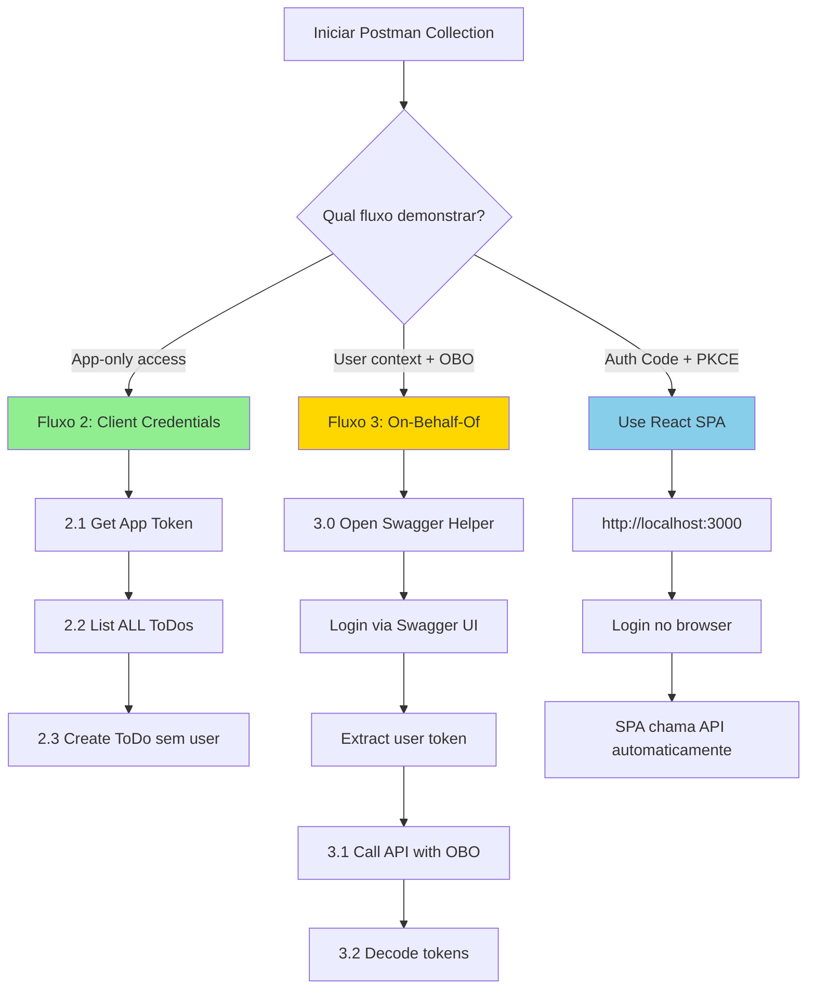

# Postman Collection - ToDoList API com Microsoft Entra External ID

Esta collection demonstra os **3 fluxos de autenticação** do projeto ToDoList de forma manual e interativa, complementando as demonstrações via UI (SPA), Swagger e Console Worker.

## ⚠️ Importante sobre o Fluxo 1 (Authorization Code + PKCE)

O **Fluxo 1** é para fins **didáticos** e pode não funcionar completamente no Postman devido a restrições de segurança do Entra ID:

- **Erro comum**: `AADSTS9002327` - SPAs só podem trocar tokens via CORS (browser)
- **Recomendação**: Use o **Fluxo 2 (Client Credentials)** para testes práticos no Postman
- **Para demonstrar Authorization Code + PKCE**: Use a UI React SPA (http://localhost:3000) que roda no browser

Se você precisa testar Authorization Code + PKCE no Postman, veja a seção **"SPA Client Type não permite Postman"** em Debugging.

## � Fluxos de Execução Recomendados



**Legenda:**
- 🟢 **Verde (Fluxo 2)**: Funciona 100% no Postman
- 🟡 **Amarelo (Fluxo 3)**: Funciona no Postman + Swagger/SPA para obter token
- 🔵 **Azul (Fluxo 1)**: Melhor via React SPA no browser

## �📋 O que a Collection Demonstra

### 1. Authorization Code + PKCE (SPA Flow)
- ✅ Gera PKCE code_verifier e code_challenge
- ✅ Authorization Code Flow com PKCE
- ✅ Public client (sem client secret)
- ✅ Delegated permissions (`ToDoList.Read`, `ToDoList.ReadWrite`)
- ✅ User context (acesso aos próprios ToDos)

### 2. Client Credentials (Daemon Flow)
- ✅ Client Credentials Flow
- ✅ Confidential client (com client secret)
- ✅ Application permissions (`ToDoList.Read.All`, `ToDoList.ReadWrite.All`)
- ✅ App-only context (acesso a TODOS os ToDos)

### 3. On-Behalf-Of (OBO Flow)
- ✅ API recebe token de usuário
- ✅ API troca por token do Microsoft Graph
- ✅ API chama Graph em nome do usuário
- ✅ Demonstra cascata de permissões delegadas

## 🚀 Pré-requisitos

1. **API rodando localmente**: `http://localhost:5000`
2. **3 App Registrations no Entra ID**:
   - SPA (public client com PKCE)
   - API (expõe scopes e app roles)
   - Console (daemon com client credentials)

## 🎯 Quick Start (Recomendado)

### Para demonstrar no Postman:

**1. Fluxo 2 - Client Credentials (5 minutos):**
```
✅ Configure variáveis: daemon_client_id, daemon_client_secret, api_base_url
✅ Execute: 2.1 → 2.2 → 2.3
✅ Demonstra: App-only access, acesso a todos os dados
```

**2. Fluxo 3 - On-Behalf-Of (10 minutos):**
```
✅ Execute: 3.0 (abre Swagger)
✅ Swagger: Authorize → Login → Extraia token do DevTools
✅ Cole token em spa_access_token
✅ Execute: 3.1 → 3.2
✅ Demonstra: API chamando Graph em nome do usuário
```

**3. Para demonstrar Authorization Code + PKCE:**
```
✅ Use React SPA: http://localhost:3000
✅ Não use Postman (restrição de segurança do Entra ID)
```

## 🔧 Configuração Completa

### 1. Importar a Collection

1. Abra o Postman
2. **Import** → **File** → Selecione `ToDoList-Entra-ID.postman_collection.json`

### 2. Configurar Variáveis

Vá em **Collections** → **ToDoList - Microsoft Entra External ID** → **Variables**

| Variável | Valor | Onde Encontrar |
|----------|-------|----------------|
| `tenant_id` | `your-tenant-guid` | Entra ID → Overview → Tenant ID |
| `tenant_subdomain` | `contoso` | Seu tenant External ID (ex: `contoso.ciamlogin.com`) |
| `spa_client_id` | `your-spa-client-guid` | SPA App Registration → Application ID |
| `spa_redirect_uri` | `http://localhost:3000` | SPA App Registration → Redirect URIs |
| `spa_scopes` | `openid profile api://{api-id}/ToDoList.Read api://{api-id}/ToDoList.ReadWrite` | API App → Expose an API |
| `daemon_client_id` | `your-daemon-client-guid` | Console App Registration → Application ID |
| `daemon_client_secret` | `your-secret-value` | Console App → Certificates & secrets |
| `daemon_scope` | `api://{api-id}/.default` | API client ID |
| `api_base_url` | `http://localhost:5000/api` | Localhost ou Docker |

**⚠️ Substitua `{api-id}` pelo Application (client) ID da API app registration**

### 3. Verificar Permissões

#### SPA App (Public Client)
- **Authentication** → Allow public client flows: ❌ No
- **API Permissions**:
  - `openid` (delegated)
  - `profile` (delegated)
  - `api://{api-id}/ToDoList.Read` (delegated)
  - `api://{api-id}/ToDoList.ReadWrite` (delegated)
- **Redirect URIs**: `http://localhost:3000` (SPA)

#### Console App (Confidential Client)
- **Certificates & secrets**: Client secret criado
- **API Permissions**:
  - `api://{api-id}/ToDoList.Read.All` (application) ✅ Admin consent granted
  - `api://{api-id}/ToDoList.ReadWrite.All` (application) ✅ Admin consent granted

#### API App
- **Expose an API** → Scopes:
  - `ToDoList.Read` (admins and users)
  - `ToDoList.ReadWrite` (admins and users)
- **App roles**:
  - `ToDoList.Read.All` (applications)
  - `ToDoList.ReadWrite.All` (applications)
- **API Permissions** (para OBO):
  - `User.Read` (delegated) ✅ Admin consent granted

## 📖 Como Executar

### Fluxo 1: Authorization Code + PKCE (SPA)

#### 1.1 Get Authorization Code (with PKCE)
1. Click **Send**
2. **Pre-request Script** gera automaticamente:
   - `code_verifier`: String aleatória (43-128 chars)
   - `code_challenge`: SHA256(code_verifier)
3. Browser abre com login do Entra ID
4. Faça login com suas credenciais
5. Você será redirecionado para: `http://localhost:3000?code=0.AXoA...&state=12345`
6. **Copie o valor do parâmetro `code`**
7. Cole em **Variables** → `spa_authorization_code`

**Verifique no Console (View → Show Postman Console):**
```
🔐 PKCE Generated:
code_verifier: dBjftJeZ4CVP-mB92K27uhbUJU1p1r_wW1gFWFOEjXk
code_challenge: E9Melhoa2OwvFrEMTJguCHaoeK1t8URWbuGJSstw-cM
```

#### 1.2 Exchange Code for Access Token (with PKCE)
1. Certifique-se de que `spa_authorization_code` está preenchido
2. Click **Send**
3. **Test Script** automaticamente:
   - Salva `spa_access_token`, `spa_refresh_token`, `spa_id_token`
   - Decodifica o access token
   - Exibe scopes no Console

**Verifique no Console:**
```
✅ SPA tokens saved
📋 Access Token Claims:
  - scp (scopes): ToDoList.Read ToDoList.ReadWrite
  - aud (audience): <api-client-id>
  - idtyp: user
  - exp: 2025-10-24T18:30:00Z
```

**Diferenças do Client Credentials:**
- ✅ Tem claim `scp` (scopes) ao invés de `roles`
- ✅ `idtyp: user` (não `app`)
- ✅ Contém `oid` (user object ID)

#### 1.3 Call ToDoList API (User Context)
1. Click **Send**
2. Retorna apenas os ToDos **do usuário autenticado**
3. API valida scope `ToDoList.Read`

#### 1.4 Create ToDo (User Context)
1. Click **Send**
2. Cria um ToDo **associado ao usuário**
3. API valida scope `ToDoList.ReadWrite`

---

### Fluxo 2: Client Credentials (Daemon)

#### 2.1 Get App-Only Access Token
1. Click **Send**
2. **Test Script** automaticamente:
   - Salva `daemon_access_token`
   - Decodifica e exibe claims

**Verifique no Console:**
```
✅ Daemon token saved
📋 App-Only Token Claims:
  - roles (app permissions): [ 'ToDoList.Read.All', 'ToDoList.ReadWrite.All' ]
  - aud (audience): <api-client-id>
  - idtyp: app ← app token
  - NO scp claim (not user context)
```

**Diferenças do user token:**
- ✅ Tem claim `roles` (não `scp`)
- ✅ `idtyp: app` (não `user`)
- ❌ Sem `oid` (não há usuário)

#### 2.2 Call ToDoList API (App Context)
1. Click **Send**
2. Retorna **TODOS os ToDos** (de todos os usuários)
3. API detecta `idtyp: app` e valida role `ToDoList.Read.All`

**Lógica da API:**
```csharp
if (HttpContext.User.Claims.Any(c => c.Type == "idtyp" && c.Value == "app"))
{
    // App-only token: retorna todos os ToDos
    return await _context.ToDos.ToListAsync();
}
else
{
    // User token: filtra por usuário
    var oid = HttpContext.User.FindFirst("oid")?.Value;
    return await _context.ToDos.Where(t => t.Owner == oid).ToListAsync();
}
```

#### 2.3 Create ToDo (App Context)
1. Click **Send**
2. Cria um ToDo **sem associação a usuário específico**
3. API valida role `ToDoList.ReadWrite.All`

---

### Fluxo 3: On-Behalf-Of (OBO)

**⚠️ Pré-requisito:** Este fluxo precisa de um **user token** (não app token do Fluxo 2).

**Opção A - Obter token via Swagger (Recomendado):**

1. **Inicie a API localmente:**
   ```bash
   cd src/ToDoList/API/ToDoListAPI
   dotnet run
   ```

2. **Abra o Swagger:** http://localhost:5000/swagger

3. **Click "Authorize"** (cadeado no topo direito)

4. **Configure:**
   - **client_id**: Seu SPA client ID (mesmo da collection)
   - **Marque os scopes**: `ToDoList.Read`, `ToDoList.ReadWrite`
   - Click **Authorize**
   - Faça login com suas credenciais

5. **Obtenha o token:**
   - Abra **DevTools** do browser (F12)
   - Vá para aba **Console**
   - **Copie e cole este script:**
   ```javascript
   // Script para extrair access token do Swagger
   (function() {
       console.log('🔍 Procurando access token...\n');
       
       // Tenta encontrar no sessionStorage
       for (let i = 0; i < sessionStorage.length; i++) {
           const key = sessionStorage.key(i);
           const value = sessionStorage.getItem(key);
           
           if (key.includes('token') || key.includes('msal')) {
               try {
                   const parsed = JSON.parse(value);
                   if (parsed.accessToken || parsed.access_token) {
                       const token = parsed.accessToken || parsed.access_token;
                       console.log('✅ Token encontrado!');
                       console.log('\n📋 Copie este token:\n');
                       console.log(token);
                       console.log('\n');
                       return token;
                   }
               } catch(e) {
                   if (value.length > 100 && value.includes('.') && value.split('.').length === 3) {
                       console.log('✅ Token encontrado!');
                       console.log('\n📋 Copie este token:\n');
                       console.log(value);
                       console.log('\n');
                       return value;
                   }
               }
           }
       }
       
       // Tenta encontrar no localStorage
       for (let i = 0; i < localStorage.length; i++) {
           const key = localStorage.key(i);
           const value = localStorage.getItem(key);
           
           if (key.includes('token') || key.includes('msal')) {
               try {
                   const parsed = JSON.parse(value);
                   if (parsed.accessToken || parsed.access_token) {
                       const token = parsed.accessToken || parsed.access_token;
                       console.log('✅ Token encontrado no localStorage!');
                       console.log('\n📋 Copie este token:\n');
                       console.log(token);
                       console.log('\n');
                       return token;
                   }
               } catch(e) {}
           }
       }
       
       console.log('❌ Token não encontrado.');
       console.log('💡 Certifique-se de ter clicado em "Authorize" e feito login.');
   })();
   ```
   - **Copie o access token** exibido no console

6. **No Postman:**
   - Vá em **Variables**
   - Cole o token em `spa_access_token`
   - Execute request **3.1 Call API with OBO Trigger**

**Opção B - Obter token via React SPA:**

1. **Inicie o SPA:**
   ```bash
   cd src/ToDoList/SPA
   npm start
   ```

2. **Acesse:** http://localhost:3000

3. **Click "Sign In"** → Faça login

4. **Obtenha o token:**
   - Abra **DevTools** (F12) → **Console**
   - Execute:
     ```javascript
     // Para MSAL v2+
     const accounts = msal.getAllAccounts();
     const request = {
       scopes: ["api://YOUR-API-CLIENT-ID/ToDoList.Read"],
       account: accounts[0]
     };
     msal.acquireTokenSilent(request).then(response => {
       console.log("Access Token:", response.accessToken);
     });
     ```
   - **Copie o access token** exibido

5. **No Postman:**
   - Cole em `spa_access_token`
   - Execute request **3.1**

**Opção C - Use ferramenta online (Quick Test):**

1. Acesse: https://jwt.ms/
2. Click **"Get a token"**
3. Configure:
   - Authority: `https://YOUR-TENANT.ciamlogin.com/YOUR-TENANT-ID`
   - Client ID: Seu SPA client ID
   - Scopes: `api://YOUR-API-ID/ToDoList.Read`
4. Login e copie o token
5. Cole em `spa_access_token` no Postman

---

#### 3.1 Call API with OBO Trigger
1. Certifique-se de que `spa_access_token` está preenchido (execute Fluxo 1 primeiro)
2. Click **Send**
3. API executa o fluxo OBO:

**Passo a passo do OBO (server-side):**
```csharp
// 1. API recebe user token (SPA → API)
var userToken = Request.Headers["Authorization"];

// 2. API troca por Graph token
var result = await confidentialClient
    .AcquireTokenOnBehalfOf(
        scopes: new[] { "https://graph.microsoft.com/User.Read" },
        userAssertion: new UserAssertion(userToken))
    .ExecuteAsync();

// 3. API chama Graph com novo token
var graphClient = new GraphServiceClient(
    new DelegateAuthenticationProvider((request) => {
        request.Headers.Authorization = 
            new AuthenticationHeaderValue("Bearer", result.AccessToken);
        return Task.CompletedTask;
    }));

// 4. API retorna dados do Graph
var user = await graphClient.Me.Request().GetAsync();
return new { 
    userEmail = user.Mail, 
    userDisplayName = user.DisplayName 
};
```

**Verifique no Console:**
```
✅ OBO flow completed successfully
📧 User email: john@contoso.com
👤 User display name: John Doe

🔄 Flow executed:
1. API received user access token (SPA → API)
2. API exchanged it for Graph token (OBO)
3. API called Microsoft Graph /me endpoint
4. Returned user info from Graph
```

#### 3.2 Decode Original Token (User → API)
1. Click **Send**
2. Browser abre `https://jwt.ms` com o token decodificado
3. **Verifique as claims**:
   - ✅ `aud`: API client ID (não Graph!)
   - ✅ `scp`: `ToDoList.Read ToDoList.ReadWrite`
   - ✅ `idtyp`: `user`

**Por que OBO é necessário?**
- Token original tem `aud: api://{api-id}` → só funciona para sua API
- Graph rejeita este token (audience errado)
- OBO troca por novo token com `aud: https://graph.microsoft.com`
- Mantém contexto de segurança do usuário (delegated permission)

---

## 🔍 Debugging

### SPA Client Type não permite Postman
**Erro:** `AADSTS9002327: Tokens issued for the 'Single-Page Application' client-type may only be redeemed via cross-origin requests`

**Causa:** O Entra ID bloqueia requisições diretas (como Postman) para apps configurados como "SPA" por segurança. SPAs só podem trocar tokens via CORS (browser).

**Solução 1 - Use Client Credentials (Recomendado):**
- Pule o **Fluxo 1** (Authorization Code + PKCE)
- Vá direto para **Fluxo 2** (Client Credentials)
- Execute requests **2.1**, **2.2**, **2.3**
- Funciona perfeitamente no Postman

**Solução 2 - Crie app confidential para demonstração:**
1. Entra ID → App registrations → **New registration**
2. Nome: `ToDoList Postman Demo`
3. Platform: **Web** (não SPA)
4. Redirect URI: `https://oauth.pstmn.io/v1/callback`
5. Certificates & secrets → **New client secret** → Copie o VALUE
6. API Permissions → Add: mesmas do SPA (`ToDoList.Read`, `ToDoList.ReadWrite`)
7. No Postman Variables:
   - `spa_client_id`: Novo app client ID
   - `spa_client_secret`: Secret value (ADICIONAR nova variável)
   - `spa_redirect_uri`: `https://oauth.pstmn.io/v1/callback`
8. Request 1.2 → Body → Adicione campo:
   - Key: `client_secret`
   - Value: `{{spa_client_secret}}`

**Nota:** O Fluxo 1 na collection é para **fins didáticos**. Na prática real:
- React SPA usa MSAL.js (roda no browser com CORS)
- Postman usa Client Credentials ou apps confidential

### PKCE Code Challenge Inválido
**Erro:** `AADSTS501491: Invalid size of Code_Challenge parameter`

**Causa:** O Pre-request Script não gerou o code_challenge corretamente.

**Solução:**
1. Verifique que o Postman tem CryptoJS disponível (versão 9.4+)
2. Abra **Postman Console** (View → Show Postman Console)
3. Execute o request 1.1 novamente
4. Verifique a saída no Console:
   ```
   🔐 PKCE Generated:
   code_verifier: dBjftJeZ4CVP-mB92K27uhbUJU1p1r_wW1gFWFOEjXk (length: 43)
   code_challenge: E9Melhoa2OwvFrEMTJguCHaoeK1t8URWbuGJSstw-cM (length: 43)
   ```
5. **code_challenge deve ter exatamente 43 caracteres**
6. Se o comprimento estiver errado, reimporte a collection

### PKCE Code Challenge Mismatch
**Erro:** `AADSTS50196: The server terminated an operation because it encountered a code challenge mismatch`

**Solução:**
1. Execute o request 1.1 novamente (gera novo `code_verifier` e `code_challenge`)
2. Copie o novo authorization code da URL
3. Execute request 1.2 imediatamente (código expira em ~10 minutos)

### Authorization Code Expirado
**Erro:** `AADSTS54005: OAuth2 Authorization code was already redeemed`

**Solução:**
- Authorization code expira em ~10 minutos e só pode ser usado uma vez
- Execute request 1.1 novamente para obter novo código

### Missing Scopes/Roles
**Erro 403:** `Insufficient privileges to complete the operation`

**User token (SPA) - Verifique:**
1. SPA App → API Permissions → Delegated scopes adicionados
2. Usuário consentiu (primeiro login ou admin consent)
3. Token contém claim `scp` com scopes corretos

**App token (Daemon) - Verifique:**
1. Console App → API Permissions → Application permissions adicionados
2. **Admin consent granted** ✅ (ícone verde de check)
3. Token contém claim `roles` com roles corretos

### OBO Flow Failed
**Erro 500:** `AADSTS65001: The user or administrator has not consented to use the application`

**Solução:**
1. API App → API Permissions → Add permission
2. Microsoft Graph → Delegated → `User.Read`
3. **Grant admin consent** (se necessário)
4. Usuário precisa consentir na primeira chamada

### Invalid Client Secret
**Erro:** `AADSTS7000215: Invalid client secret is provided`

**Solução:**
1. Entra ID → Console App → Certificates & secrets
2. Crie um novo secret
3. Copie o **VALUE** (não o Secret ID)
4. Atualize `daemon_client_secret` no Postman

## 🎯 Comparação dos 3 Fluxos

| Aspecto | Authorization Code + PKCE | Client Credentials | On-Behalf-Of |
|---------|---------------------------|--------------------|--------------| 
| **Client Type** | Public (SPA) | Confidential (Daemon) | Confidential (API) |
| **User Context** | ✅ Sim | ❌ Não (app-only) | ✅ Sim (via OBO) |
| **Permissões** | Delegated (scopes) | Application (roles) | Delegated (cascata) |
| **Token Claim** | `scp` | `roles` | `scp` (Graph token) |
| **idtyp** | `user` | `app` | `user` |
| **Client Secret** | ❌ Não (usa PKCE) | ✅ Sim | ✅ Sim |
| **Acesso aos dados** | Próprio usuário | Todos os usuários | Usuário via Graph |
| **Exemplo Real** | React SPA, Mobile App | Background Worker, Migração | API chamando Graph/SharePoint |

## 🎓 Conceitos Demonstrados

### 1. PKCE (Proof Key for Code Exchange)
- **Problema**: Public clients não podem guardar secrets com segurança
- **Solução**: 
  - Gera `code_verifier` aleatório no cliente
  - Calcula `code_challenge = SHA256(code_verifier)`
  - Envia challenge no authorize
  - Envia verifier no token exchange
  - Servidor valida: SHA256(verifier) == challenge
- **Resultado**: Mesmo se authorization code for interceptado, atacante não consegue trocar por token (não tem o verifier)

### 2. Delegated vs Application Permissions
- **Delegated** (`scp`):
  - Usuário + App acessam recursos
  - Menor privilégio entre os dois
  - Requer usuário logado
  - Ex: SPA lê ToDos do usuário
- **Application** (`roles`):
  - Apenas App acessa recursos
  - Privilégio total concedido pelo admin
  - Sem usuário (daemon)
  - Ex: Worker processa todos os ToDos

### 3. On-Behalf-Of (OBO) Flow
- **Cenário**: API precisa chamar API downstream em nome do usuário
- **Flow**:
  1. SPA → API (user token A, audience: API)
  2. API → Entra ID (troca token A por token B, audience: Graph)
  3. API → Graph (token B)
  4. Graph → API (dados)
  5. API → SPA (dados)
- **Segurança**: Mantém contexto do usuário na cadeia de chamadas
- **Consent**: Usuário precisa consentir que API acesse Graph em seu nome

### 4. Token Claims: `idtyp`
```json
// User token (SPA → API)
{
  "idtyp": "user",
  "scp": "ToDoList.Read ToDoList.ReadWrite",
  "oid": "user-object-id"
}

// App token (Console → API)
{
  "idtyp": "app",
  "roles": ["ToDoList.Read.All", "ToDoList.ReadWrite.All"]
}
```

API usa `idtyp` para decidir se filtra por usuário ou retorna todos os dados.

## 📚 Recursos Adicionais

- [OAuth 2.0 Authorization Code Flow](https://learn.microsoft.com/entra/identity-platform/v2-oauth2-auth-code-flow)
- [PKCE RFC 7636](https://datatracker.ietf.org/doc/html/rfc7636)
- [Client Credentials Flow](https://learn.microsoft.com/entra/identity-platform/v2-oauth2-client-creds-grant-flow)
- [On-Behalf-Of Flow](https://learn.microsoft.com/entra/identity-platform/v2-oauth2-on-behalf-of-flow)
- [JWT.ms - Token Decoder](https://jwt.ms)

---

**MVP Conf 2025** | Demonstração de OAuth 2.0 & OpenID Connect Flows
